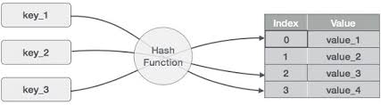

# HashTable_10Million_records

Custom Database with more than 10 million records with features like search, add and delete

To execute, simply run the individual files in a code editor of your choice (I used Anaconda's Spyder).
